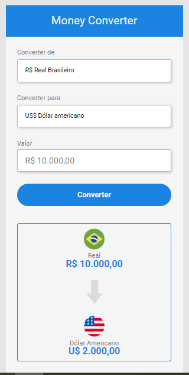
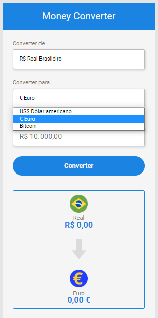
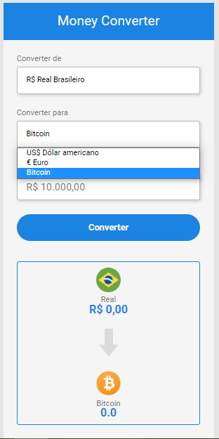

# Conversor de Moedas

> Esse conversor de moedas é um dos meus projetos favoritos e foi desenvolvido por mim com o auxílio das aulas do DevClub utilizando HTML, CSS e JavaScript. Há a possibilidade de converter a moeda Real Brasileiro para Dólar Americano, Euro e Bitcoin.

O site publicado pode ser acessado [aqui](https://marcellemarichal.github.io/currency-converter/)

### Ajustes e melhorias

As próximas atualizações serão voltadas às seguintes tarefas:

- [ ] Adicionar atualização diária do valor de cada moeda
- [ ] Acrescentar outras opções de moedas
- [ ] Tornar possível adicionar o valor de outras moedas para serem convertidas, não apenas o Real
